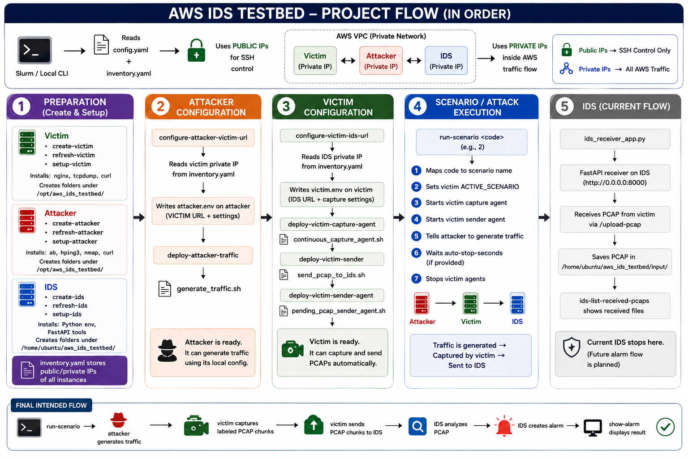
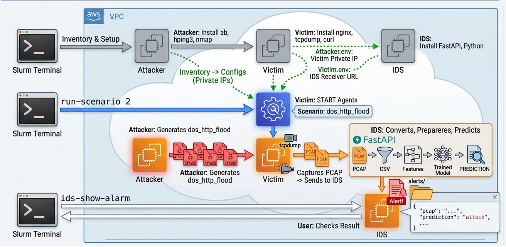
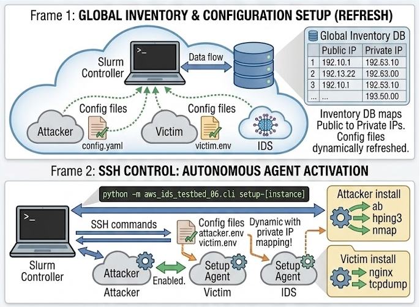
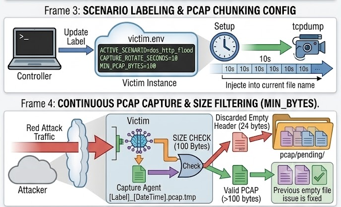
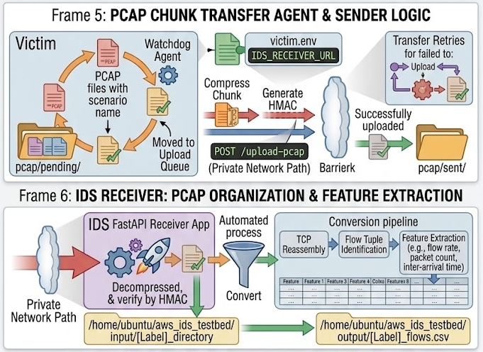
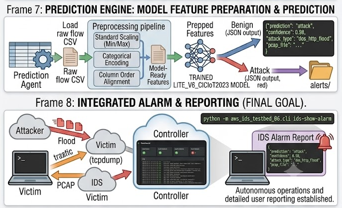

# AWS IDS Testbed: Automated Cloud Network Security Laboratory

AWS IDS Testbed is a Python-based cybersecurity laboratory for building a controlled intrusion-detection environment on AWS. It creates separate victim, attacker, and IDS EC2 instances, generates labeled network traffic, captures packets on the victim, and transfers completed PCAP files to the IDS host for analysis.



*Project flow from infrastructure preparation through traffic capture and IDS delivery. The final analysis and alarm stages shown at the bottom are planned extensions.*

> **Authorized use only:** Run this project only in an AWS account and network that you own or are explicitly authorized to test. Never direct the traffic-generation tools toward public or third-party systems.

## Project goals

The project is designed to:

- Provision victim, attacker, and IDS EC2 instances.
- Configure every instance automatically for its assigned role.
- Generate repeatable benign and controlled attack traffic.
- Label traffic scenarios when packets are captured.
- Capture packets continuously or for a fixed duration.
- Transfer completed PCAP files automatically to the IDS host.
- Build a reliable dataset for intrusion-detection research.
- Convert PCAP data into structured features and CSV files.
- Apply a trained IDS model to classify network traffic.
- Report detected threats through clear alerts.

## Current project status

The current code implements the AWS infrastructure and PCAP collection pipeline:

```text
Attacker EC2
    │
    │ benign or controlled attack traffic
    ▼
Victim EC2
    │ capture, label, rotate, and queue PCAP files
    ▼
IDS EC2
    │ receive and store PCAP files
    ▼
Future processing: PCAP → CSV → model inference → alert
```

Implemented features:

- EC2 creation, inventory refresh, and termination.
- Automated victim, attacker, and IDS host setup.
- Benign HTTP traffic generation.
- Controlled HTTP-flood and SYN-flood simulations.
- Fixed-duration and continuous packet capture.
- Scenario labels in capture filenames.
- Automatic transfer of pending PCAP files.
- A FastAPI PCAP receiver on the IDS host.
- CLI commands for deploying, starting, stopping, verifying, and inspecting services.

Planned stages not yet implemented in the current code:

- PCAP-to-CSV conversion and feature extraction.
- Trained-model deployment and inference.
- Traffic classification and alert presentation.

## Architecture

The laboratory uses three EC2 roles:

| Role | Responsibility |
| --- | --- |
| Victim | Runs Nginx, receives test traffic, captures packets, labels PCAP files, and sends completed captures to the IDS. |
| Attacker | Generates benign HTTP requests and controlled HTTP or SYN traffic against the victim's private address. |
| IDS | Runs a FastAPI receiver and stores uploaded PCAP files for later processing and detection. |

Communication between the hosts should use private AWS addresses. Public addresses are used only for trusted administrative SSH access.

### End-to-end architecture



*Conceptual end-to-end architecture. The current implementation reaches PCAP reception on the IDS host; conversion, prediction, and alarm reporting represent the intended final pipeline.*

### Detailed workflow diagrams

#### Inventory, configuration, and remote setup



The controller maintains instance information, derives communication settings, and uses SSH to deploy the software required by each EC2 role.

#### Scenario labeling and continuous capture



The victim reads the active scenario label, captures rotating packet chunks, rejects empty captures, and moves valid PCAP files into the pending queue.

#### PCAP transfer and IDS intake



The sender agent uploads queued captures to the IDS receiver and moves successful transfers into the sent directory. Feature extraction shown after IDS intake is a planned stage.

#### Prediction and alerting goal



The intended final stage prepares extracted features for a trained model, classifies the traffic, stores prediction results, and presents an alarm when an attack is detected.

## Repository structure

```text
AWS_IDS_TestBed/
├── README.md                    Main project documentation
├── .gitignore                   Repository-wide exclusions
└── aws_ids_testbed_*/
    ├── aws_ids_testbed_*/       Python package and CLI controller
    ├── scripts/                 Setup, capture, sender, and traffic scripts
    ├── artifacts/               Local generated artifacts
    ├── config.yaml              AWS and instance configuration
    ├── inventory.yaml           Runtime EC2 inventory
    ├── ProjectProgress.md       Development history
    └── requirements.txt         Python dependencies
```

Private keys, virtual environments, inventory data, packet captures, CSV datasets, and model files are excluded from Git.

## Prerequisites

Prepare the following before running the laboratory:

- An AWS account with permission to create, describe, tag, and terminate EC2 instances.
- A least-privilege IAM user or role; do not use the AWS root account.
- AWS CLI credentials configured on the local machine.
- Python with virtual-environment support.
- An EC2 key pair and its private `.pem` file.
- A VPC, subnet, and security group for the laboratory.
- Security-group rules allowing:
  - SSH from your trusted administration address.
  - Internal HTTP communication from the attacker to the victim.
  - Internal TCP communication from the victim to the IDS on port `8000`.

AWS resources can generate charges. Review the selected instance types and terminate all resources after testing.

## Step-by-step process

### 1. Clone the repository

```bash
git clone https://github.com/Samira-Nazari/AWS-IDS-Testbed-Automated-Cloud-Network-Security-Laboratory.git
cd AWS-IDS-Testbed-Automated-Cloud-Network-Security-Laboratory
```

### 2. Enter the implementation directory

The repository currently contains one active implementation directory. Detect it and derive its Python package name without hard-coding a release counter:

```bash
PROJECT_DIR="$(find . -mindepth 1 -maxdepth 1 -type d -name 'aws_ids_testbed_*' | head -n 1)"
cd "$PROJECT_DIR"
PACKAGE="$(basename "$PWD")"
```

Confirm the selected values:

```bash
printf 'Project directory: %s\nPackage: %s\n' "$PWD" "$PACKAGE"
```

### 3. Create the Python environment

```bash
python3 -m venv env_aws_ids
source env_aws_ids/bin/activate
python -m pip install --upgrade pip
python -m pip install -r requirements.txt
```

After opening a new terminal, return to the implementation directory, reactivate the environment, and set `PACKAGE` again.

### 4. Configure AWS authentication

```bash
aws configure
aws sts get-caller-identity
```

Verify that the returned account and IAM identity belong to the intended laboratory account. Never place access keys or secret keys in source files.

### 5. Prepare the EC2 private key

Place the private key associated with the configured EC2 key pair in the implementation directory, then restrict its permissions:

```bash
chmod 400 <private-key-file>.pem
```

The private key is ignored by Git and must never be committed.

### 6. Configure the laboratory

Edit `config.yaml` and provide values for:

- AWS region.
- EC2 key-pair name.
- Security-group ID.
- Subnet ID.
- AMI ID and instance type for every role.
- SSH username and, when required, private-key path.

Inspect the effective configuration without creating resources:

```bash
python -m "$PACKAGE.cli" status
python -m "$PACKAGE.cli" show-config
```

### 7. Create and configure the victim

Create the instance:

```bash
python -m "$PACKAGE.cli" create-victim
```

After the instance reaches the `running` state, refresh its network details and install the victim software:

```bash
python -m "$PACKAGE.cli" refresh-victim
python -m "$PACKAGE.cli" setup-victim
```

The victim setup installs Nginx and packet-capture tools. It also creates directories for PCAP files that are being written, waiting for transfer, successfully sent, or marked as failed.

### 8. Create and configure the IDS host

```bash
python -m "$PACKAGE.cli" create-ids
```

After the instance is running:

```bash
python -m "$PACKAGE.cli" refresh-ids
python -m "$PACKAGE.cli" setup-ids
python -m "$PACKAGE.cli" deploy-ids-receiver
python -m "$PACKAGE.cli" ids-start-receiver
```

The IDS receiver listens on TCP port `8000`. Permit access from the victim through the private laboratory network, but do not expose this service broadly to the internet.

### 9. Create and configure the attacker

```bash
python -m "$PACKAGE.cli" create-attacker
```

After the instance is running:

```bash
python -m "$PACKAGE.cli" refresh-attacker
python -m "$PACKAGE.cli" setup-attacker
python -m "$PACKAGE.cli" show-inventory
```

The attacker setup installs tools for HTTP requests, controlled load generation, SYN traffic, and network inspection.

### 10. Configure communication between the hosts

Configure the attacker to target the victim's private address:

```bash
python -m "$PACKAGE.cli" configure-attacker-victim-url
python -m "$PACKAGE.cli" attacker-verify-victim-url
python -m "$PACKAGE.cli" deploy-attacker-traffic
python -m "$PACKAGE.cli" verify-attacker-traffic
```

Configure the victim to send captures to the IDS private address:

```bash
python -m "$PACKAGE.cli" configure-victim-ids-url
python -m "$PACKAGE.cli" victim-verify-ids-url
```

### 11. Deploy the victim capture and sender tools

Deploy the fixed-duration capture and PCAP sender tools:

```bash
python -m "$PACKAGE.cli" deploy-victim-capture
python -m "$PACKAGE.cli" verify-victim-capture
python -m "$PACKAGE.cli" deploy-victim-sender
python -m "$PACKAGE.cli" verify-victim-sender
```

Deploy the continuous capture and automatic sender agents:

```bash
python -m "$PACKAGE.cli" deploy-victim-capture-agent
python -m "$PACKAGE.cli" verify-victim-capture-agent
python -m "$PACKAGE.cli" deploy-victim-sender-agent
python -m "$PACKAGE.cli" verify-victim-sender-agent
```

### 12. Run traffic scenarios

Available traffic codes:

| Code | Scenario | Purpose |
| --- | --- | --- |
| `1` | `benign_http` | Normal HTTP baseline traffic |
| `2` | `dos_http_flood` | Controlled HTTP load simulation |
| `3` | `dos_syn_flood` | Controlled SYN traffic simulation |

Run a benign HTTP scenario:

```bash
python -m "$PACKAGE.cli" run-scenario 1 \
  --requests 100 \
  --concurrency 5 \
  --auto-stop-seconds 15
```

Run a controlled HTTP-flood scenario:

```bash
python -m "$PACKAGE.cli" run-scenario 2 \
  --requests 1000 \
  --concurrency 50 \
  --auto-stop-seconds 15
```

Run a controlled SYN-flood scenario:

```bash
python -m "$PACKAGE.cli" run-scenario 3 \
  --packet-count 100 \
  --port 80 \
  --auto-stop-seconds 15
```

The scenario command sets the active label on the victim, starts the capture and sender agents, generates the matching attacker traffic, waits for the requested interval, and stops the agents automatically.

Start with conservative values. Increase request, concurrency, or packet counts only when the isolated environment has been verified and the additional load is intentional.

### 13. Inspect captured and received files

```bash
python -m "$PACKAGE.cli" victim-agents-status
python -m "$PACKAGE.cli" victim-list-pcaps
python -m "$PACKAGE.cli" ids-list-received-pcaps
```

Victim capture states:

- `writing`: capture is still in progress.
- `pending`: capture is complete and waiting for upload.
- `sent`: upload to the IDS succeeded.
- `failed`: capture processing or upload failed.

The IDS stores received PCAP files in its input directory for future feature extraction and analysis.

### 14. Stop background agents when necessary

If a scenario was started without automatic stopping, stop both victim agents:

```bash
python -m "$PACKAGE.cli" victim-stop-agents
```

Inspect or manage each agent separately:

```bash
python -m "$PACKAGE.cli" victim-capture-agent-status
python -m "$PACKAGE.cli" victim-sender-agent-status

python -m "$PACKAGE.cli" victim-stop-capture-agent
python -m "$PACKAGE.cli" victim-stop-sender-agent
```

### 15. Terminate AWS resources

Terminate all three instances when the experiment is complete:

```bash
python -m "$PACKAGE.cli" terminate-victim
python -m "$PACKAGE.cli" terminate-attacker
python -m "$PACKAGE.cli" terminate-ids
```

Refresh and inspect their final states:

```bash
python -m "$PACKAGE.cli" refresh-victim
python -m "$PACKAGE.cli" refresh-attacker
python -m "$PACKAGE.cli" refresh-ids
python -m "$PACKAGE.cli" show-inventory
```

Check the AWS console afterward for any remaining chargeable resources associated with the laboratory.

## Manual pipeline testing

Generate benign HTTP traffic:

```bash
python -m "$PACKAGE.cli" generate-benign-http
```

Capture a labeled scenario for a fixed duration:

```bash
python -m "$PACKAGE.cli" victim-capture-scenario \
  --scenario benign_http \
  --seconds 20
```

Send one existing PCAP to the IDS:

```bash
python -m "$PACKAGE.cli" victim-send-pcap \
  --pcap-path /opt/aws_ids_testbed/pcap/pending/<capture-file>.pcap \
  --scenario benign_http
```

Send every pending PCAP:

```bash
python -m "$PACKAGE.cli" victim-send-pending-pcaps
```

## Troubleshooting

### Inventory is empty or incomplete

Run the appropriate refresh command after an EC2 instance reaches the `running` state. Remote administration requires a public IP in `inventory.yaml`, while communication between laboratory hosts uses private IP addresses.

### SSH connection fails

Check the private-key path and permissions, SSH username, instance state, public IP, and inbound SSH rule. Restrict SSH access to your trusted source address.

### The victim cannot reach the IDS receiver

Confirm that the receiver is running, the victim configuration contains the IDS private URL, and the security group permits victim-to-IDS TCP traffic on port `8000`.

### No PCAP is produced

Confirm that the capture agent is running and traffic reaches the victim. Empty capture chunks are intentionally discarded.

### PCAP files remain pending

Check the sender agent, receiver process, IDS URL, private-network route, and security-group rule. Failed uploads remain available for investigation and retry.

## Security and cost guidance

- Run simulated attacks only inside the authorized laboratory network.
- Never target external IP addresses or third-party services.
- Restrict security-group access to trusted sources and required ports.
- Use a least-privilege IAM identity and rotate credentials regularly.
- Never commit `.pem` files, credentials, inventory, captures, datasets, or models.
- Inspect staged files with `git status` before every commit.
- Stop background processes and terminate EC2 instances after testing.
- Review the AWS billing dashboard after each experiment.

## License

No license has been specified. Add a license before distributing the project or accepting external contributions.
